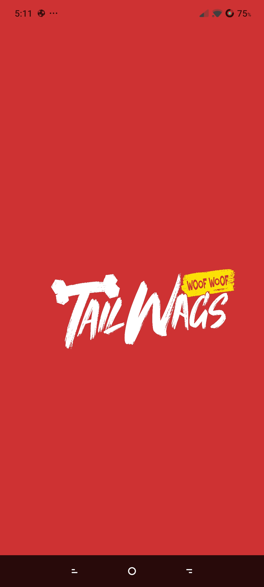
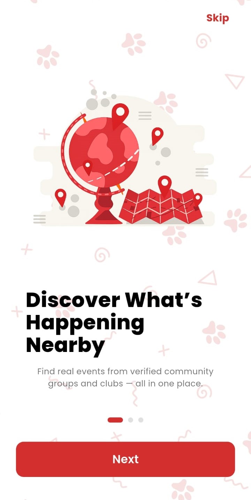
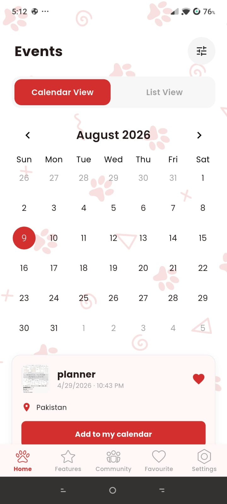

# TailWags — Flutter Event Management Platform

A cross-platform event management app built 
at Skypulse Solution. Event discovery, seat 
booking, user authentication, and real-time 
data handling — iOS and Android from one 
Flutter codebase.

## Screenshots

  
  &nbsp;&nbsp;&nbsp;&nbsp;
  
  &nbsp;&nbsp;&nbsp;&nbsp;
  

## Features
- Event discovery and browsing
- Seat selection and booking flow
- Multi-role user authentication
- Real-time data synchronization
- Interactive UI with smooth animations
- Cross-platform iOS and Android

## Tech Stack
- Flutter & Dart
- Firebase Firestore
- Firebase Authentication
- REST APIs

## Getting Started
Clone the repo and run flutter pub get.
Requires Firebase project setup.
